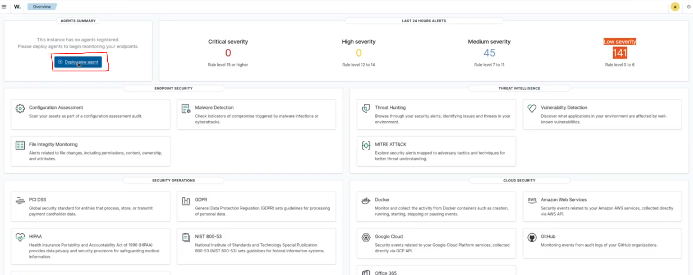
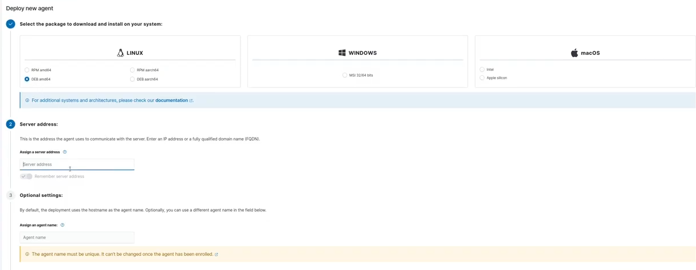
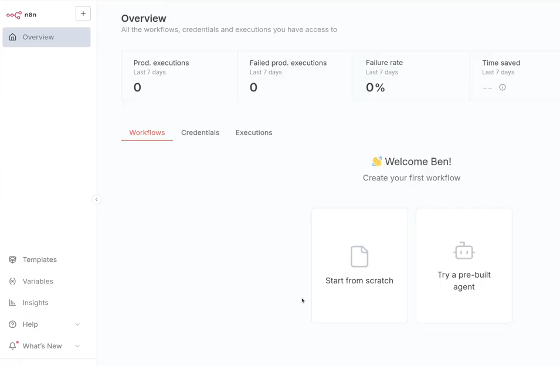

# راهنمای راه اندازی Wazuh به همراه N8N
سیستم مورد نیاز:  
- CPU: 2 Cores
- Ram: 8GB
- Storage: 50GB (minimum), 100GB (Recommended)
- OS: Ubuntu 20.04+ Server
- Static IP Required

در ترمینال اوبونتو دستورات زیر را وارد کنید.
```bash
sudo apt update && sudo apt upgrade
sudo apt install -y git
cd ~
git clone https://github.com/ArtA110/wazuh-n8n-lab-setup.git
cd wazuh-n8n-lab-setup
```
سپس با دستور زیر داکر را نصب کنید.
```bash
sudo ./install-docker.sh
```
پس از اتمام نصب با ```exit``` از حالت ادمین بیرون بیایید.  
سپس لازم است تا ایمیج های موردنیاز را دریافت کرده و کامپوزهای موردنیاز را اجرا کنید، برای این منظور از دستور زیر استفاده کنید.
```bash
sudo ./docker-spin-up.sh
```
پس از اتمام مراحل برای بررسی موفقیت آمیز بودن میتوانید از ```docker ps``` استفاده کنید، در نتیجه این دستور باید 4 کانتینر درحال اجرا داشته باشید.
- *اگر دستور ```docker ps``` ارور دسترسی داد آنرا با sudo اجرا کتید*  
اگر عملیات موفقیت آمیز باشد لینک های زیر در دسترس خواهند بود.
- [Wazuh](https://localhost)
- [N8N](http://localhost:5678)  

*از آنجایی که احتمالا از سیستم دیگری میخواهید پنل ها را مشاهده کنید باید بجای localhost از آدرس IP ماشینی که کانتینرها برروی آن در حال اجرا هستند استفاده کنید، دقت کنید که تنها آیپی را جایگزین localhost کنید و به پروتکل های https و http دست نزنید*

اطلاعات لاگین Wazuhمانند زیر میباشد.
- Username: admin
- Password: SecretPassword  

برای اضافه کردن agent پس از لود شدن پنل Wazuh طبق تصویر زیر برروی دکمه موردنظر کلیک کنید.


  

در پنل باز شده مشخصات agent خواسته شده را وارد کنید.  

  

در بالای صفحه سیستم عاملی که قرار است agent برروی آن نصب شود را انتخاب کنید.  
آیپی سروری که Wazuh را برروی آن نصب کرده اید را در Server Address وارد کتید.  
یک نام برای Agent موردنظر انتخاب کنید.  
حال در قسمت پایین صفحه لیستی از دستورات نمایش داده میشود که باید در سیستم عاملی که میخواهید agent را نصب کنید بترتیب آنهارا وارد کنید.  


برای ورود به N8N باید یک اکانت تشکیل دهید.  
تشکیل اکانت نکته خاصی ندارد، اطلاعات موردنیاز را وارد کنید. درنهایت باید به صفحه ای مشابه تصویر زیر هدایت شوید.  


  

لطفا توجه داشته باشید، برای درخواست دادن از طریق n8n به api های موجود در wazuh باید از نام کانتینر بعنوان دامنه استفاده کنید.  
بطور پیشفرض Wazuh سه کانیتنر دارد که در n8n از indexer برای سرچ در وقایع و دیتاها استفاده خواهد شد.  
نام کانتینر هارا با دستور ```docker ps``` میتوانید بدست بیاورید.

